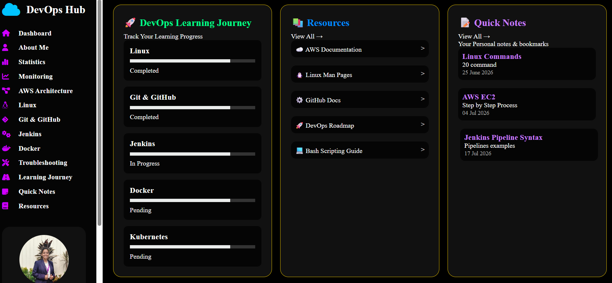

# Cloud-Based Linux Server Deployment with GitHub Version Control and Automation

## Project Overview

This project demonstrates the deployment of a static website on an AWS cloud-based Linux server using DevOps practices.

The main objective of this project is to gain practical knowledge of:

- AWS Cloud Infrastructure
- Linux Server Administration
- Git & GitHub Version Control
- Web Server Deployment
- Bash Automation
- Server Monitoring
- Troubleshooting

The website is hosted on an AWS EC2 Ubuntu instance using Apache Web Server.

---

# AWS Architecture

The project architecture follows this workflow:

Developer

↓

Visual Studio Code

↓

Git Repository

↓

GitHub Repository

↓

AWS EC2 Ubuntu Server

↓

Apache Web Server

↓

Live Website


## AWS Services Used

| Service | Purpose |
|---|---|
| Amazon EC2 | Hosting Linux server |
| Security Group | Firewall configuration |
| Ubuntu | Operating system |
| Apache2 | Web server |
| GitHub | Source code management |


---

# Installation Steps

## Step 1: Launch AWS EC2 Instance

1. Login to AWS Console
2. Open EC2 service
3. Launch Ubuntu Server instance
4. Configure Security Group:
   - SSH Port 22
   - HTTP Port 80


---

## Step 2: Connect to Server

Command:

```bash
ssh -i key.pem ubuntu@public-ip
```


---

## Step 3: Update Server

```bash
sudo apt update

sudo apt upgrade -y
```


---

## Step 4: Install Apache Web Server

```bash
sudo apt install apache2 -y
```


Check Apache status:

```bash
sudo systemctl status apache2
```


---

## Step 5: Deploy Website

Navigate to Apache directory:

```bash
cd /var/www/html
```


Copy website files:

```
index.html
css/
js/
images/
```


Restart Apache:

```bash
sudo systemctl restart apache2
```


Website can be accessed using:

```
http://EC2-Public-IP
```


---

# Commands Used

## Linux Commands

| Command | Purpose |
|---|---|
| ls | List files |
| cd | Change directory |
| pwd | Current location |
| mkdir | Create folder |
| chmod | Change permissions |
| nano | Edit files |


## AWS Commands

| Command | Purpose |
|---|---|
| ssh | Connect EC2 server |
| systemctl | Manage services |


## Git Commands

| Command | Purpose |
|---|---|
| git init | Initialize repository |
| git add . | Add files |
| git commit | Save changes |
| git push | Upload to GitHub |
| git status | Check repository status |


---

# Folder Structure

```
DevOps-Fundamentals-Project/

│── README.md

│── index.html

│── health-check.sh

│── apache-monitor.sh

│── backup.sh

│── log-report.txt


├── screenshots/

│   ├── aws-setup.png

│   ├── website.png

│   └── github.png


├── documentation/

│   └── Project_Report.pdf
```


---

# Automation Scripts

## 1. Health Check Script

File:

```
health-check.sh
```

Purpose:

- CPU monitoring
- Memory monitoring
- Disk monitoring
- User monitoring
- Process monitoring


---

## 2. Apache Monitor Script

File:

```
apache-monitor.sh
```


Purpose:

- Checks Apache service status
- Automatically restarts Apache if stopped


---

## 3. Backup Script

File:

```
backup.sh
```


Purpose:

- Creates website backup
- Stores compressed backup files


---

# Challenges Faced

During project implementation, several challenges were faced:

## 1. EC2 Connection Issues

Problem:
Unable to connect to Ubuntu server.

Solution:
Checked key permissions and SSH configuration.


---

## 2. Website Not Opening

Problem:
Website was not accessible through public IP.

Solution:

- Checked Security Group
- Enabled HTTP Port 80
- Restarted Apache service


---

## 3. File Permission Issues

Problem:
Apache could not access website files.

Solution:

Used:

```bash
sudo chmod -R 755 /var/www/html
```


---

## 4. GitHub Upload Issues

Problem:
Files were not visible in repository.

Solution:

Checked:

```bash
git status

git add .

git commit

git push
```


---

# Learning Outcomes

After completing this project, I learned:

✅ AWS EC2 server deployment

✅ Linux server management

✅ Apache web server configuration

✅ Git and GitHub version control

✅ Bash scripting automation

✅ Server monitoring techniques

✅ Log analysis and troubleshooting

✅ DevOps project workflow


---

# Project Screenshots

## AWS Setup


## Website Deployment




## GitHub Repository


---

# Conclusion

This project provided practical exposure to DevOps fundamentals by deploying a cloud-based website using AWS, Linux, GitHub, and automation scripts.

The project helped understand the complete workflow from code development to cloud deployment and monitoring.